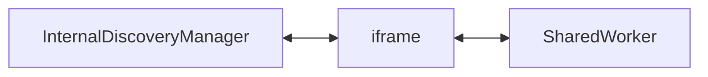

# Internal discovery infrastructure

The internal discovery system allows code from different origins to communicate with each other
via a SharedWorker hosted by an editor. This is useful when, for instance, you would like to
connect the inspector of an editor to an app running in a different tab.

This document contains an overview of how this system works in two sections:
- [a high level overview](#high-level-overview), describing how to use the InternalDiscoveryManager
- [a low level overview](#low-level-overview), explaining more about how internal discovery works under the hood.

## High level overview

Internal discovery usage fairly straight forward. The main class that you're looking for is `InternalDiscoveryManager`,
it can be found at [src/Inspector/InternalDiscoveryManager.js](../../../../../src/Inspector/InternalDiscoveryManager.js).

It's important to note that normally you should not have to deal with creating your own InternalDiscoveryManager
in order to connect an editor inspector. When running games from the editor, this is usually taken care for you.
But if you want to host your app from your own domain or local server, this information might be useful.
In that case you'll likely want to create an `InspectorManager` rather than an `InternalDiscoveryManager`,
but some of their parameters have some overlap.

Depending on how you use Renda, you can import it like this:
```js
import {InternalDiscoveryManager} from "renda";
```
or like this:
```js
import {InternalDiscoveryManager} from "src/Inspector/InternalDiscoveryManager.js";
```

When creating an InternalDiscoveryManager, it needs to know which url to connect to.
When you want two separate tabs to be able to communicate with each other,
they need to both connect to the same url in order to find each other.

When hosting your app from the editor, figuring out this url is automatically taken care of.
The InternalDiscoveryManager tries to communicate with its creator window and ask what this url is.
But this won't work when your app was not opened from an editor, when you host your app on your own (local) server
and manually type in its address in the browser for example. In that case you will have to let the InternalDiscoveryManager know
what url you would like to use. The url is likely something like `https://renda.studio/internalDiscovery.html`,
but might be different if you are using a specific version or hosting your own editor. To provide a url, you can use two options.

When using `fallbackDiscoveryUrl`, the InternalDiscoveryManager will first attempt to request a url from the parent window,
in case the page is being hosted by an editor. If that fails, the fallback url will be used.

```js
const internalDiscovery = new InternalDiscoveryManager({
	fallbackDiscoveryUrl: "https://localhost:8080/myDiscoverymanager",
});
```

You can also use `forceDiscoveryUrl`, which will use the provided url immediately,
without even attempting to request a url from the parent window.

```js
const internalDiscovery = new InternalDiscoveryManager({
	forceDiscoveryUrl: "https://localhost:8080/myDiscoverymanager",
});
```

Once your InternalDiscoveryManager is created, you can register your client using `internalDiscovery.registerClient()`,
listen for available clients and connect to them.

## Low level overview

There are essentially three realms communicating with each other:



The iframe exists to allow the SharedWorker to be created from all origins.
It is pretty shallow, and mostly just passes messages between the `InternalDiscoveryManager` and the `SharedWorker`.
The SharedWorker keeps track of connected clients and provides functionality for connecting them to each other.

The iframe and shared worker are hosted as part of the editor. And so all their files can be found in this directory.
`internalDiscoveryIframeEntryPoint.js` and `internalDiscoveryWorkerEntryPoint.js` are the main entry points
for the iframe and the shared worker respectively.

The `InternalDiscoveryManager` itself, which sets everything in motion, needs to be shipped in applications,
and so its files can be found in the engine source at [src/Inspector/InternalDiscoveryManager.js](../../../../../src/Inspector/InternalDiscoveryManager.js).

For now the internal discovery management is only used for two things:

- For inspectors of running applications to connect to editors.
  Allowing users to inspect scenes and modify assets while the app is running.
- For communication between multiple editor tabs. Allowing communication between editors
  from different origins wasn't necessarily the goal, but a nice benefit that came with using
  the existing infrastructure.
