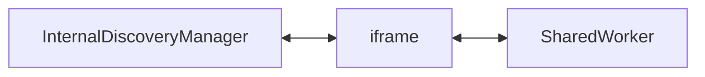

# Internal Discovery Infrastructure

The internal discovery system allows code from different origins to communicate with each other
via a SharedWorker hosted by a studio instance. This is useful when, for instance, you would like to
connect the inspector of a studio instance to an app running in a different tab.

Note that cross-origin communication may not be supported depending on your browser:
https://github.com/rendajs/Renda/issues/805

Though internal discovery is mostly meant for connecting to and from inspectors,
it can also be used to connect to another studio instance.
Connecting to studio instances is more useful when done through the WebRtcDiscoveryMethod,
but doing it via the InternalDiscoveryMethod can still be useful while developing some functionality related to StudioConnections.

## High-Level Overview

Normally you shouldn't have to deal with creating your own `DiscoveryManager`.
When running applications from Renda Studio, this is usually taken care of for you.
Just make sure your application instantiates an `InspectorManager` (if you have imported services from `"renda:services"`,
this is also already taken care of for you).

If you want to host your app from your own domain or local server, this information might still be useful though.
This section will go over how the `InspectorManager` uses a `DiscoveryManager` under the hood.

A [DiscoveryManager](../../../../../src/network/studioConnections/DiscoveryManager.js) allows you to
list available connections and connect to them:

```js
const manager = new DiscoveryManager("inspector");
const internalMethod = manager.addDiscoveryMethod(InternalDiscoveryMethod, "https://renda.studio/internalDiscovery");
manager.onAvailableConnectionsChanged(() => {
	for (const connection of manager.availableConnections()) {
		manager.requestConnection(connection.id);
	}
});
```

But this is only useful if you have UI that allows the user to pick a connection or configure the discovery endpoint.
With inspectors you usually don't want to have to configure all of that though,
you just want it to connect to whatever studio is open.

The [ParentStudioHandler](../../../../../src/network/studioConnections/ParentStudioHandler.js) takes care
of exactly that. It checks whether the page has been embedded inside the build view of Renda Studio,
and creates a temporary connection with the parent.
It will then ask the parent how it should make the InternalDiscoveryMethod, and which client it should connect to.

That way, inspectors can connect to the open studio without any action required from the user.

## Low-Level Overview

There are essentially three realms communicating with each other:



The iframe exists to allow the SharedWorker to be created from all origins.
It is pretty shallow, and mostly just passes messages between the `InternalDiscoveryManager` and the `SharedWorker`.
The SharedWorker keeps track of connected clients and provides functionality for connecting them to each other.

The iframe and shared worker are hosted as part of the renda.studio domain. And so all their files can be found in this directory.
`internalDiscoveryIframeEntryPoint.js` and `internalDiscoveryWorkerEntryPoint.js` are the main entry points
for the iframe and the shared worker respectively.

The `InternalDiscoveryManager` itself, which sets everything in motion, needs to be shipped in applications,
and so its files can be found in the engine source at [src/inspector/InternalDiscoveryManager.js](../../../../../src/inspector/InternalDiscoveryManager.js).
